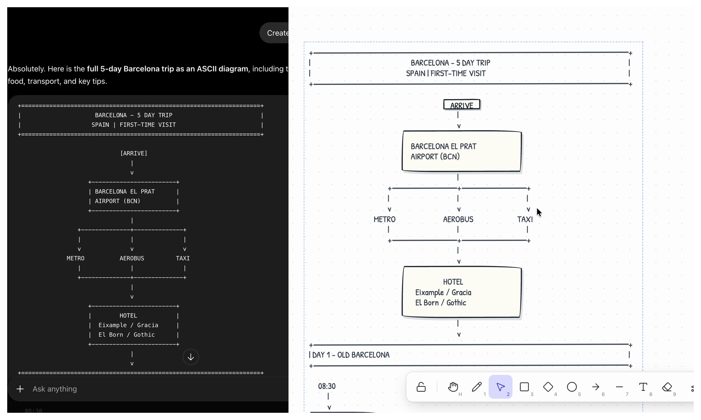
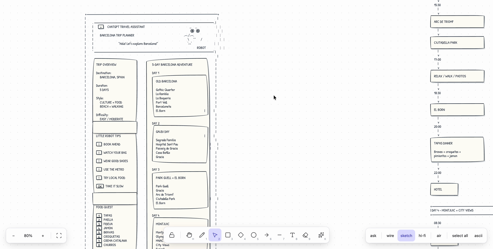
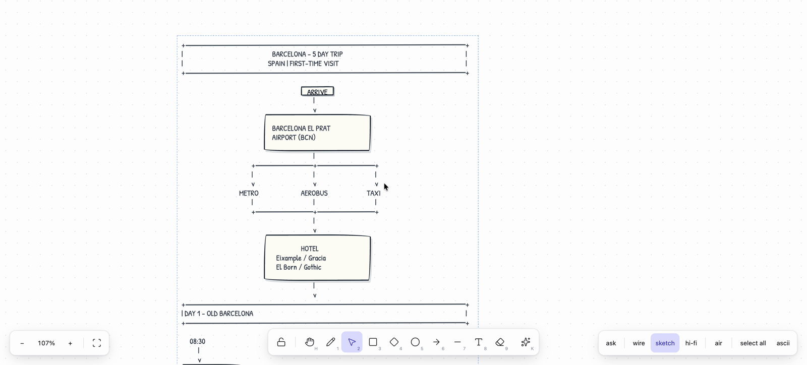

# ascii designer

**Paste ASCII, get components.** A white canvas where a person and a language model draw in the same medium: plain text.



<p align="center"><em>Left: what ChatGPT answered. Right: the same text after ⌘V on the canvas.</em></p>

[**Try it →** ascii-designer-production.up.railway.app](https://ascii-designer-production.up.railway.app)

## What it is for

Models are fluent in ASCII. Ask any of them for a wireframe, a flow, a plan or an architecture diagram and you get
box-drawing characters back. That output is precise, diffable and free to produce, and it dies in the chat window.

This canvas reads it. Every rectangle, button, input, checkbox, icon and arrow becomes a component you can drag,
resize, restyle and re-export. Nothing needs a schema, an API or a plugin: the wire format is the text both sides
already speak, so one drawing travels from a chat, to a canvas, to a screenshot in a doc, and back again.

Use it to turn a model's answer into something you can work with, to sketch a UI faster than in a design tool, or to
hand a model a picture of your app and get a wireframe you can edit.

## How it works

```
   text ──read()──►  tree of items  ──renderSheet()──►  canvas
                          ▲   │
        print() ──────────┘   └────────► ASCII again (⌘C)
```

The **tree is the truth; ASCII is import and export**. `public/reader.js` turns characters into items: rectangles,
including regions carved by `├ ┬ ┤ ┴` junctions and boxes whose sides wobble a column or two, plus a dozen idioms,
placed exactly where the characters were at 8 × 18 px per cell. `public/printer.js` turns items back into characters,
with proper junctions where boxes touch. Anything unrecognised survives as grey text, so nothing is lost.

Because the model reads and writes that same text, the AI features are thin: no special format, no function calling.



## AI on the canvas

| | |
|---|---|
| **✦ (K)** | Click anywhere, say what should appear there. The answer streams in as ASCII and is re-read line by line, so components land while the model is still writing. |
| **ask (⌘K)** | Select things, say what should change: *put these in a row*, *2 × 2 grid*, *align left*, *clean it up*. The model gets every element's id and position and answers with layout operations that `ops.js` applies exactly. |
| **screenshots** | ⌘V an image. It is redrawn as an ASCII wireframe, which lands as components. |
| **⌘Z / ⌘⇧Z** | Undo and redo, AI changes included, one step each. |

Put `MINIMAX_API_KEY` in `.env` and `server.js` proxies `POST /ai`, so the key never reaches the browser.
`MINIMAX_MODEL` defaults to `MiniMax-M3`, the one MiniMax model that can see images. The request disables thinking;
without that, the whole token budget goes to reasoning about the picture instead of drawing.

## Run it

```
npm start      # → http://localhost:3000   (PORT=3737 node server.js if 3000 is taken)
npm test
```

No build and no dependencies. `public/` is the whole app; `reader.js` and `printer.js` are the interesting files.
Deployed on Railway with `railway up`; the API key and model live in the service variables.

## The idioms

| ASCII | becomes |
|---|---|
| `┌───┐ │ └───┘` or `+---+ \| +---+` | frame (outermost) / box (nested); `┌─ Title ─┐` keeps the title. Roles from geometry: page, mobile, nav, footer, sidebar, main, panel, card, tile |
| a box full of `╲ ╱` diagonals | image |
| `[ Sign up ]` | button |
| `[email_______]` | input with placeholder |
| `[ Photo ▾ ]` | select |
| `[x]` `[ ]` `(o)` `( )` | checkbox / radio |
| `< Watch demo >` | link |
| `# ## ###` | headings |
| `──►` `-->` `<──` `→` | arrows (drawn arrows print in any direction: `─ │ ╲ ╱` with `► ◄ ▲ ▼` heads) |
| drawn circles | print as `╭──╮ ╱ ╲ ╰──╯` ellipses |
| `─────` `-----` `=====` | divider |
| `~~~~~~` `[ img ]` | image placeholder |
| `[:bell:]`, or a box holding only `:rocket:` | icon (Lucide); the box is the icon's size |
| everything else | text — or grey "unknown" if it is mostly symbols |

⌘⇧P copies `public/PROMPT.md`, the prompt that makes a model draw ASCII this reader understands.



## Canvas

Scroll pans, ⌘+scroll zooms, space+drag pans. Click selects the innermost component (the frame selects the sheet),
⇧-click adds, a marquee on empty canvas picks a region. Drag moves the selection, the corner handle scales it as a
group in cells (children follow their boxes, text keeps its width), ⌫ deletes it, ⌘C prints it as one ASCII drawing.
Double-click a sheet to edit it as ASCII and re-import. ⌘⇧C copies the reader's JSON for a sheet, the hook for
anything that wants to sit on top. Sheets persist in localStorage.

**Tools**, centre bar, numbered like Excalidraw: 🔓 keep tool (Q) · hand (H) · 1 pen (freehand, prints as `─ │ ╱ ╲`) ·
2 select · 3 rectangle · 4 diamond · 5 ellipse · 6 arrow · 7 line · 8 text · 9 eraser · ✦ AI (K). The letters
V R D O A L T E P still work. A shape drawn inside a sheet joins it, snapped to its cells; elsewhere it starts a new one.

**Bottom right**: ask · the wire / sketch / hi-fi skins (sketch is the default) · **air**, which gives every border its
own line with a cell of space between so sketchy strokes never cross, while the tree stays tight so ⌘C and the model
still get the compact ASCII · select all (⌘A) · **ascii**, which renders the whole canvas back to one drawing and copies it.
